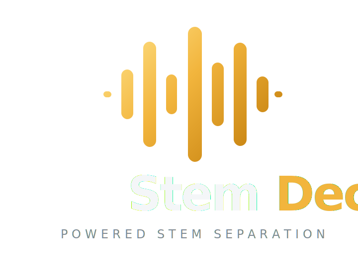
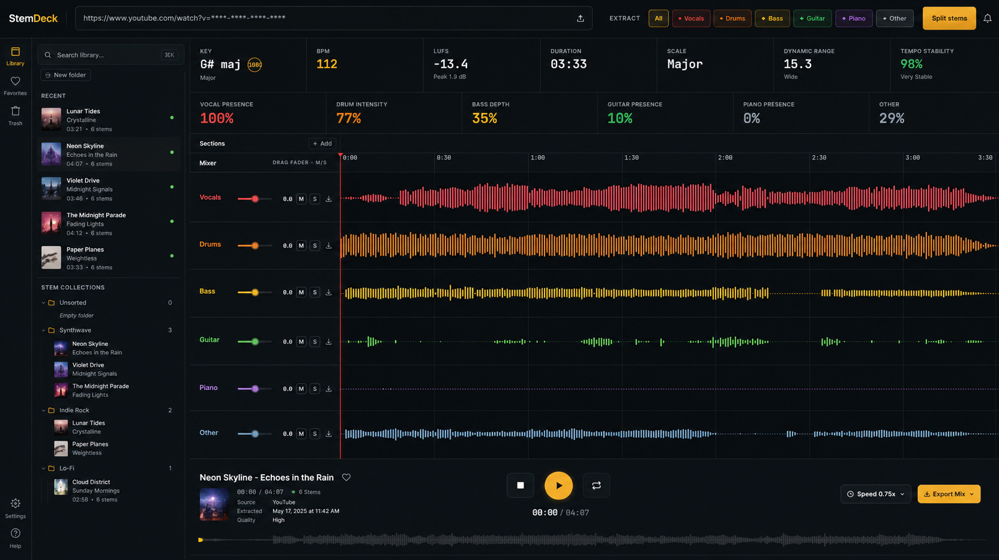

<div align="center">



**Free, local stem separation. No account. No upload. No subscription.**

<div align="center">
  <a href="https://github.com/stemdeckapp/stemdeck/actions/workflows/ci.yml"></a>
  <a href="https://github.com/stemdeckapp/stemdeck/stargazers"></a>
  <a href="https://github.com/stemdeckapp/stemdeck/releases"></a>
  <a href="https://github.com/stemdeckapp/stemdeck/releases/latest"></a>
  <a href="https://github.com/stemdeckapp/stemdeck/blob/main/LICENSE"></a>
</div>

<br>

<p align="center"><sub>JOIN THE COMMUNITY</sub></p>
<div align="center">
  <a href="https://github.com/stemdeckapp/stemdeck"></a>
  <a href="https://discord.gg/2MVsWqaPRe"></a>
  <a href="https://www.reddit.com/r/StemDeckApp/"></a>
  <a href="https://www.instagram.com/stemdeck"></a>
  <a href="https://x.com/StemDeckApp"></a>
  <a href="https://stemdeck.app"></a>
</div>

</div>

<br>

Drop in an MP3, WAV, or FLAC file, or paste a YouTube URL, and StemDeck splits the audio into up to six stems (vocals, drums, bass, guitar, piano, other). Play them back in a DAW-style multitrack mixer: mute, solo, balance levels, zoom the waveform, loop a region, and export individual stems or a custom mix. Everything runs locally on your own machine.

> **What is this?** StemDeck is a stem separation tool, not a downloader. Its main job is processing audio you already own: drag an MP3, WAV, or FLAC onto the import bar and go. YouTube support is a convenience for content you have the right to process. StemDeck does not store, cache, or redistribute any downloaded content. Everything happens locally and nothing leaves your machine.

> StemDeck is a free, open alternative to cloud stem-splitters like Moises and LALAL.AI: no account, no quota, no uploads, no subscription. If you want stems for personal study and prefer to keep things local and free, StemDeck has you covered. If you need the polish, a mobile app, or deeper musician tooling, the commercial products are a better fit.



## We Recommend

StemDeck is free and **does not accept any money, sponsorship, or funding** - not from users, not from anyone listed below. We share these makers and artists purely for the joy of pointing you toward wonderful people doing beautiful work. Go meet them ❤️

| Name | What they do | Link |
|---|---|---|
| Dlima Guitars | Custom guitars and basses | [@dlimaguitars](https://www.instagram.com/dlimaguitars) |
| Lisbon Guitar Works | Guitar building | [dlimaguitars.com](https://dlimaguitars.com) |
| Joao Gaspar | Producer/Film Scorer, Touring/Session Musician | [@jay_glaspar](https://www.instagram.com/jay_glaspar) |
| Kris Luthier | Luthier and Musical Instrument Repair, Lisboa | [@krisluthier](https://www.instagram.com/krisluthier) |
| Thomann | Online Music Store | [@thomann.music](https://www.instagram.com/thomann.music) |
| Analog4Lyfe | Analog music gear | [@analog4lyfe](https://www.instagram.com/analog4lyfe) |
| Empress Effects | Effects pedals | [empresseffects.com](https://empresseffects.com) |
| More Notes Less Talk | Instruments and gear with personality, recorded raw to tape. No hype, no gatekeeping. | [@morenoteslesstalk](https://www.youtube.com/@morenoteslesstalk) |


---

## Features

**6-stem separation** via Demucs `htdemucs_6s`, with auto-detection of the best Torch device (CUDA on NVIDIA, MPS on Apple Silicon, CPU fallback).

**YouTube and local file import.** Paste a YouTube URL or drop an MP3 or WAV directly onto the import bar.

**DAW-style waveform editor** with min/max sample rendering across all stems, shared normalization, zoom in/out/Fit, loop drag on the ruler, gold playhead overlay, and stem-aligned lanes.

**Stem subset extraction.** Click stem chips to choose which stems to keep. Clicking from "all selected" snaps to "only this one"; subsequent clicks add or remove.

**"Original" backing track.** When you pick a subset, a 7th lane contains the complement (full song minus selected stems), perfect for A/B reference without doubling.

**Downloadable selected mix.** A single `mix.wav` of just your selected stems, summed via ffmpeg amix.

**Per-stem mixer** with volume fader, mute, solo, and "monitor" (solo-only) per stem. State syncs between the preview mixer and the stems sidebar.

**Live VU meters** per stem. Post-gain RMS via Web Audio analysers with peak hold and slow falloff.

**Song analysis** including BPM (librosa beat tracker), key, scale, and confidence (Albrecht-Shanahan profiles), integrated LUFS (BS.1770), and sample peak in dBFS.

**Cancellable jobs.** Cancel mid-pipeline and the runner terminates the active subprocess immediately, deletes the partial job dir, and returns to ready.

**Library panel** with folder-based track organisation, drag-and-drop, search, and trash.

---

## Honest Comparison

StemDeck is not trying to compete with commercial stem-separation products. It covers the core use case well and stops there. This table exists so you can make an informed choice rather than discover the gaps after the fact.

| | StemDeck | Moises / LALAL.AI / similar |
|---|---|---|
| **Price** | Free, forever | Freemium; credits or subscription required for regular use |
| **Hosting** | Runs entirely on your machine | Cloud; audio must be uploaded to their servers |
| **Account / login** | None | Required |
| **Internet required** | Only for YouTube download and first model fetch (~170 MB, cached after) | Always; no offline use |
| **Privacy** | Audio never leaves your machine | Audio is uploaded and processed on third-party servers |
| **Data retention** | You control it; delete anytime | Governed by their privacy policy and retention period |
| **Stem model** | Demucs `htdemucs_6s` (open source, Meta AI) | Proprietary models, regularly updated, generally higher quality |
| **Stem count** | 6 (vocals, drums, bass, guitar, piano, other) | Up to 10 depending on service and plan |
| **Input formats** | YouTube URL, MP3, WAV | MP3, WAV, FLAC, M4A, and more depending on service |
| **Processing speed** | Depends on your hardware; fast with a GPU, slow on CPU only | Fast regardless of your hardware (runs on their servers) |
| **Batch processing** | One job at a time | Yes, on paid plans |
| **Mobile app** | No | iOS and Android |
| **Extra features** | No (no pitch shift, chord detection, lyrics, click track, BPM tap) | Yes, varies by product |
| **Polish** | Functional, hobby-grade UI | Polished, production-grade apps |
| **Source code** | Open source, forkable, self-hostable | Closed source |

If you need speed, quality, mobile access, or the extra musician tooling, the commercial products are worth the money. If you want stems for personal study, prefer to keep audio private, or just want something that runs locally with no strings attached, StemDeck is enough.

---

## Download

Pre-built installers and zips are attached to each [GitHub Release](https://github.com/stemdeckapp/stemdeck/releases).

**macOS**

| DMG | GPU | Chip |
|---|---|---|
| `StemDeck-macOS-arm64.dmg` | Apple Silicon (MPS) | M1 and later |
| `StemDeck-macOS-x64.dmg` | CPU only | Intel |

Open the DMG, drag StemDeck to Applications, and launch it. On first launch the setup screen downloads the Python runtime (~500 MB), FFmpeg, and the Demucs model (~170 MB). Subsequent launches skip setup and start in seconds. No Python or system dependencies required.

macOS may show a Gatekeeper prompt on first open — right-click the app and choose Open to bypass it.

**Windows**

| Zip | GPU | Approx. size |
|---|---|---|
| `StemDeck-Windows-x64.zip` | CPU only | ~700 MB |
| `StemDeck-Windows-x64.NVIDIA.zip` | NVIDIA CUDA | ~1.6 GB |

Extract the zip anywhere, run `StemDeck.exe`. On first launch the app verifies the bundled Python runtime and downloads FFmpeg and the Demucs model (~170 MB). Subsequent launches skip this and start in seconds. Everything is self-contained; no Python or system dependencies required.

---

## Technologies

<div align="center">
  
  
  
</div>

<br>

StemDeck is built on **[Python 3.12](https://python.org)** managed via **[uv](https://github.com/astral-sh/uv)**, with a **[FastAPI](https://fastapi.tiangolo.com)** backend serving REST and Server-Sent Events. Stem separation uses **[Demucs](https://github.com/facebookresearch/demucs)** (`htdemucs_6s`), Meta AI's open-source 6-stem neural network. YouTube audio is fetched via **[yt-dlp](https://github.com/yt-dlp/yt-dlp)**; transcoding and mixing use **[FFmpeg](https://ffmpeg.org)**. BPM detection and key analysis run on **[librosa](https://librosa.org)**; loudness measurement uses **[pyloudnorm](https://github.com/csteinmetz1/pyloudnorm)** (ITU-R BS.1770). The macOS and Windows desktop shells are **[Tauri v2](https://tauri.app)** (Rust/WKWebView on macOS, Rust/WebView2 on Windows). The frontend is vanilla JS with the Web Audio API, no framework and no build step; waveforms are rendered on `<canvas>` using min/max sample rendering.

*Thanks to the creators and maintainers of all the open-source libraries that make StemDeck possible.*

---

## Build from Source

### macOS Native App

Requires Rust, Node.js, and Python 3.12. Builds a self-contained `.app` that downloads its own runtime on first launch.

```sh
# First time only — add the cross-compilation targets
rustup target add aarch64-apple-darwin   # Apple Silicon
rustup target add x86_64-apple-darwin    # Intel

# Build Apple Silicon
ARCH=arm64 scripts/macos/make-runtime-pack.sh
ARCH=arm64 scripts/macos/make-app.sh
ARCH=arm64 scripts/macos/make-dmg.sh

# Build Intel (requires Rosetta 2 and an x86_64 Python)
ARCH=x64 scripts/macos/make-runtime-pack.sh
ARCH=x64 scripts/macos/make-app.sh
ARCH=x64 scripts/macos/make-dmg.sh
```

The `.app` lands at `desktop/src-tauri/target/<target>/release/bundle/macos/StemDeck.app`. The DMG lands at `.build/macos-dist/StemDeck-macOS-<arch>.dmg`.

To run a fresh build directly without the DMG:

```sh
open desktop/src-tauri/target/aarch64-apple-darwin/release/bundle/macos/StemDeck.app
```

If macOS blocks the app with a Gatekeeper prompt, run:

```sh
xattr -dr com.apple.quarantine desktop/src-tauri/target/aarch64-apple-darwin/release/bundle/macos/StemDeck.app
```

> **Note:** To test a clean first-launch during development, you can wipe previous app data first: `rm -rf ~/Library/Application\ Support/StemDeck`. Don't do this on a real install.

---

### Web Server (macOS / Linux / Windows with Python 3.12+)

#### Prerequisites

Python 3.12 or newer, `ffmpeg` on your PATH, and [uv](https://github.com/astral-sh/uv). Around 170 MB of free disk for the Demucs model, which downloads automatically on first run.

#### macOS / Linux (one-shot)

```sh
git clone https://github.com/stemdeckapp/stemdeck stemdeck && cd stemdeck
./run.sh setup     # installs ffmpeg + uv, runs uv sync
./run.sh start
```

Open <http://localhost:8000>.

`setup` uses Homebrew on macOS and `apt-get` on Debian/Ubuntu. For other Linux distros, install `ffmpeg` and [uv](https://github.com/astral-sh/uv) manually, then run `uv sync` followed by `./run.sh start`.

#### Windows (PowerShell)

Install prerequisites:
- [uv](https://docs.astral.sh/uv/getting-started/installation/) — `winget install astral-sh.uv`
- [ffmpeg](https://ffmpeg.org/download.html) — `winget install Gyan.FFmpeg` (or Chocolatey: `choco install ffmpeg`)

```powershell
git clone https://github.com/stemdeckapp/stemdeck stemdeck; cd stemdeck
uv sync
uv run uvicorn app.main:app --host 127.0.0.1 --port 8000
```

Open <http://localhost:8000>.

> `run.sh` is macOS/Linux only. On Windows use the PowerShell commands above, or run inside WSL.

**NVIDIA GPU (CUDA):** install the CUDA-enabled torch build before starting:

```powershell
uv pip install torch torchvision torchaudio --index-url https://download.pytorch.org/whl/cu124
$env:STEMDECK_DEMUCS_DEVICE = "cuda"
uv run uvicorn app.main:app --host 127.0.0.1 --port 8000
```

---

#### Manual (any platform)

```sh
git clone https://github.com/stemdeckapp/stemdeck stemdeck && cd stemdeck
uv sync
uv run uvicorn app.main:app --reload
```

#### Docker

```sh
docker compose -f build/docker-compose.yml up --build
```

Stems land in `./jobs/` on the host. Demucs weights are cached in a named volume so they don't re-download on rebuild. Note: no GPU passthrough on macOS Docker.

A prebuilt image is published to GHCR. Tags: `edge` (rolling, rebuilt on every merge to main), `latest` (newest stable release), and `X.Y.Z` (pinned to a release).

```sh
docker run -d --name stemdeck -p 8000:8000 \
  -v /path/to/jobs:/app/jobs \
  -v /path/to/cache:/cache \
  -e STEMDECK_PERSIST_LIBRARY=1 \
  ghcr.io/stemdeckapp/stemdeck:edge
```

On a Linux host with an NVIDIA GPU (driver + NVIDIA Container Toolkit installed), add `--runtime=nvidia -e NVIDIA_VISIBLE_DEVICES=all` and StemDeck auto-detects CUDA. The image already bundles CUDA-enabled torch, so no separate CUDA install is needed.

#### Unraid

StemDeck is available in Unraid Community Applications: open **Apps**, search "StemDeck", and install. Map the two volumes to persistent appdata paths:

- `/app/jobs` -> `/mnt/user/appdata/stemdeck/jobs` (library + stems)
- `/cache` -> `/mnt/user/appdata/stemdeck/cache` (model weights)

The library is persistent by default (`STEMDECK_PERSIST_LIBRARY=1`), so tracks are never auto-deleted. For GPU acceleration, install the **Nvidia Driver** plugin, then set the container's Extra Parameters to `--runtime=nvidia` (the `NVIDIA_VISIBLE_DEVICES` and `NVIDIA_DRIVER_CAPABILITIES` variables are already in the template). CPU-only works with no extra configuration.

#### `run.sh` control script

```sh
./run.sh setup      # one-shot: install ffmpeg + uv, then uv sync
./run.sh start      # boots uvicorn in the background
./run.sh stop       # graceful shutdown
./run.sh restart    # stop + start
./run.sh status     # is it running?
```

---

## How to Use

1. On the import bar, click stem chips to choose which stems to extract (defaults to all 6).
2. Paste a YouTube URL **or** drop an MP3/WAV file, then click **Process**.
3. Wait through `Uploading...` / `Downloading...` → `Analyzing...` → `Separating...` → `Mixing tracks...`.
4. When done, the studio dashboard appears. If you picked a subset, the first lane is **Original** (full song minus your selection); the rest are your isolated stems.
5. Mix: **Play/Pause/Stop** controls the master transport. **M** mutes a stem, **S** solos it (additive; multiple solos stay audible), **Monitor** solos only that stem and clears others. The volume fader moves 1:1 with drag; double-click resets to 0 dB; `Shift+wheel` gives coarse adjustment and plain wheel gives fine. The **Reset**, **Mute**, and **Solo** toolbar buttons act on all stems at once.
6. Drag on the ruler to define a loop region; click `Loop` to enable. Use `+` / `-` / `Fit` or `Ctrl/Cmd+wheel` to zoom.
7. **Download Mix** in the footer gives you a WAV of your selected stems summed together.

**Keyboard shortcuts:** `Space` play/pause · `[` seek -5s · `]` seek +5s · `L` loop · `I` loop in · `O` loop out

---

## Configuration

| Variable | Default | Purpose |
|---|---|---|
| `STEMDECK_DEMUCS_DEVICE` | auto | Force Torch device: `cuda`, `mps`, or `cpu`. |
| `STEMDECK_DEMUCS_MODEL` | `htdemucs_6s` | Demucs model name. |
| `STEMDECK_JOBS_DIR` | `./jobs` | Where job directories land. |
| `STEMDECK_DATA_DIR` | (none) | Portable mode root; sets all sub-dirs below to live inside it. |
| `STEMDECK_CACHE_DIR` | `<data>/cache` | Torch model cache directory. |
| `STEMDECK_DOWNLOADS_DIR` | `<data>/downloads` | yt-dlp download scratch space. |
| `STEMDECK_MODELS_DIR` | `<data>/models` | Demucs model weights directory. |
| `STEMDECK_LOGS_DIR` | `<data>/logs` | Log file output directory. |
| `STEMDECK_FFMPEG_DIR` | (none) | Directory containing a bundled ffmpeg binary. |
| `STEMDECK_FFMPEG` | `ffmpeg` | Path to the ffmpeg executable. |
| `STEMDECK_FFPROBE` | `ffprobe` | Path to the ffprobe executable. |
| `STEMDECK_MAX_DURATION_SEC` | `1200` | Reject audio longer than this (seconds). |
| `STEMDECK_JOB_TTL_SECONDS` | `86400` | How long to keep job dirs on disk. |
| `STEMDECK_MAX_PENDING_JOBS` | `3` | Max queued jobs before returning 503. |
| `STEMDECK_TIMEOUT_FFMPEG` | `300` | ffmpeg subprocess timeout (seconds). |
| `STEMDECK_TIMEOUT_ANALYZE` | `120` | Audio analysis timeout (seconds). |
| `STEMDECK_TIMEOUT_DEMUCS_STALL` | `1800` | Kill Demucs if no output for this many seconds. |

`run.sh` also reads: `HOST` (default `127.0.0.1`), `PORT` (default `8765`), `RELOAD=1` (enable uvicorn auto-reload for development), `FOREGROUND=1` (run in foreground instead of backgrounding).

---

## API

| Method | Path | Purpose |
|---|---|---|
| GET | `/api/health` | Server health and version info |
| POST | `/api/jobs` | JSON `{url, stems?}` or multipart `file + stems` → `{job_id}` |
| GET | `/api/jobs` | List completed (library) jobs |
| GET | `/api/jobs/{id}` | Job state snapshot |
| GET | `/api/jobs/{id}/events` | SSE stream of job state |
| POST | `/api/jobs/{id}/cancel` | Terminate active subprocess and cancel job |
| PATCH | `/api/jobs/{id}/sections` | Save waveform section markers for a job |
| GET | `/api/jobs/{id}/stems/{name}.wav` | Stream a single stem WAV file |
| GET | `/api/jobs/{id}/stems/{name}.mp3` | Transcode and stream a stem as MP3 |
| GET | `/api/jobs/{id}/video.mp4` | Mux the current mix with the source video (MP4 upload or YouTube) into an MP4 |
| DELETE | `/api/jobs/{id}` | Remove job dir from disk (terminal jobs only) |

---

## Troubleshooting

**`ffmpeg: command not found`:** install ffmpeg and restart with `./run.sh restart`.

**`WARNING: [youtube] No supported JavaScript runtime`:** install deno (`brew install deno` on macOS) and restart. Downloads still work without it but may pick suboptimal formats.

**First separation is very slow:** Demucs downloads `htdemucs_6s` weights (~170 MB) on first run; cached afterwards.

**Demucs runs on CPU only:** check the startup log for `device=mps` or `device=cuda`. If you see `cpu`, your torch install may be CPU-only.

**Page reloaded mid-job:** the job keeps running server-side. Wait for it to finish, then resubmit.

**`./run.sh: Permission denied`:** run `chmod +x run.sh`.

---

## Layout on Disk

```
jobs/<job_id>/
└── stems/
    ├── vocals.wav      # the 6 Demucs stems (always present)
    ├── drums.wav
    ├── bass.wav
    ├── guitar.wav
    ├── piano.wav
    ├── other.wav
    ├── original.wav    # sum of un-selected stems (subset only)
    └── mix.wav         # ffmpeg amix of selected stems (subset only)
```

Job state is in-memory. Restart the server and the job list resets, but files persist on disk. Old dirs are swept automatically (TTL 24 h, configurable).

---

## Disclaimer

StemDeck is a local audio stem separation tool intended for personal study, research, and experimentation. It is not a downloading service. It does not store, cache, or redistribute any audio content. All processing runs on the user's own machine and no audio is transmitted anywhere.

YouTube URL support is provided via [yt-dlp](https://github.com/yt-dlp/yt-dlp) as a convenience. Automated downloading may violate YouTube's Terms of Service. You, the user, are solely responsible for ensuring you have the right to process any audio you submit, complying with the terms of service of any site you download from, and respecting the copyright of the material you work with.

You are also responsible for following the licenses of the underlying tools this project depends on (yt-dlp, Demucs, FFmpeg, PyTorch, and others listed in `pyproject.toml`).

The author(s) of StemDeck provide this software "as is", without warranty of any kind, and accept no responsibility or liability for how it is used.

---

## Community

| Platform | Link |
|---|---|
| GitHub | [stemdeckapp/stemdeck](https://github.com/stemdeckapp/stemdeck) |
| Discord | [discord.gg/2MVsWqaPRe](https://discord.gg/2MVsWqaPRe) |
| Reddit | [r/StemDeckApp](https://www.reddit.com/r/StemDeckApp/) |
| Instagram | [@stemdeck](https://www.instagram.com/stemdeck) |
| X | [@StemDeckApp](https://x.com/StemDeckApp) |
| Website | [stemdeck.app](https://stemdeck.app) *(coming soon)* |

---

## Environment Variables

These are for development and testing. Release builds only recognize the variables marked "release".

| Variable | Platform | Scope | Description |
|---|---|---|---|
| `STEMDECK_DATA_DIR` | all | release | Override the user data directory (default: platform-standard location) |
| `STEMDECK_ROOT` | all | release | Override the app root directory (default: derived from executable path) |
| `STEMDECK_PYTHON` | all | **debug builds only** | Override the Python executable path |
| `STEMDECK_FFMPEG_URL` | Windows, macOS | release | Override the FFmpeg download URL |
| `STEMDECK_FFPROBE_URL` | macOS | release | Override the ffprobe download URL |

---

## Contributing

Issues, feature suggestions, and pull requests are welcome. See open issues for what's planned.

---
